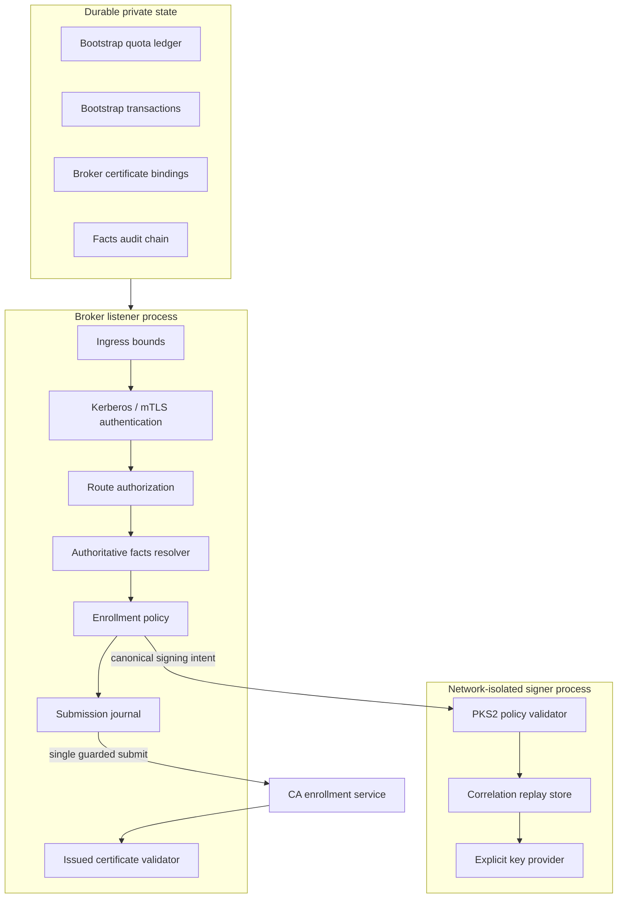

# Component architecture

Inbound SOAP is bounded by raw bytes, read time, XML depth, node count,
attribute count, text size, and decoded token size before DOM, ASN.1, state,
signer, or CA work. Public health is constant or cached; a serialized background
self-test performs dependency checks independently of request traffic.

Durable stores use bounded state graphs and conservative ambiguity handling.
The submission journal claims work before CA transport so retries cannot create
a second submission. Bootstrap reserves count and worst-case bytes before it
publishes a retained request.
