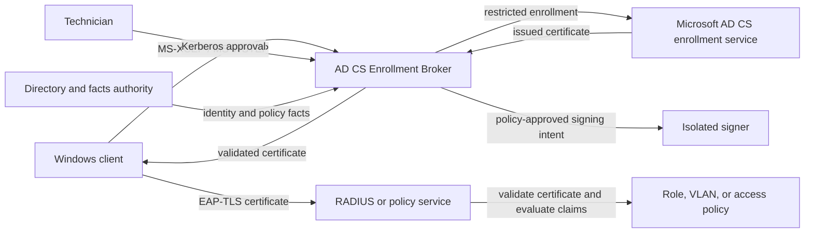

# System context and trust boundaries

The Windows client generates and retains its private key. It supplies proof
material and a public-key request, but it cannot select the certificate subject,
SAN claims, template, or CA. The broker derives those values from authenticated
identity and authoritative facts.

The signer has no network access and accepts only a versioned signing intent
whose generation, profile, template, correlation, CMC bytes, and digest satisfy
its independent policy. A PKCS#11 provider can keep the signer key outside the
listener process. Software PKCS#11 is suitable for development; production key
custody requires an independently governed hardware or equivalent boundary.

The CA, directory, DNS, time source, revocation publisher, container host, and
signer administrator are explicit trust dependencies. Compromise of the broker
can misstate authenticated identity or facts before a valid signer request is
constructed. The signer limits key use, but it cannot independently establish
the upstream directory truth.

The broker and facts authority participate when the certificate is issued or
renewed; they are not required for each EAP-TLS authentication. The relying
party validates the certificate and applies its own compact policy to the
approved claims. The certificate informs that decision but does not grant a
role or VLAN by itself. See [why this exists](../why.md) for the alternatives
and the signed-snapshot freshness boundary.
