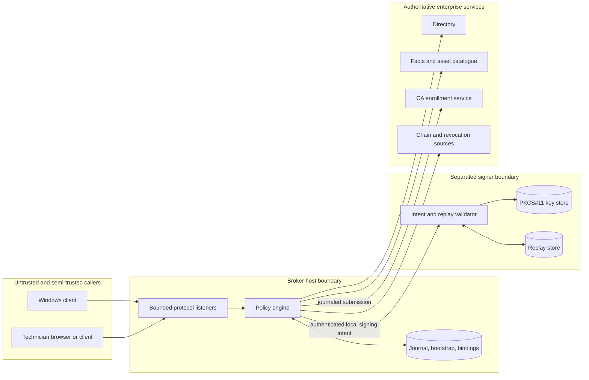

# Trust boundaries and durable state

| Boundary | Trust placed in it | Required separation |
| --- | --- | --- |
| Client | Generates and retains the private key; presents native proof | Cannot select subject, SAN, template or CA |
| Broker | Authenticates, resolves facts, decides policy and validates output | Dedicated identity; bounded listeners; owner-only state |
| Signer | Enforces intent schema, generation, digest and replay policy | Separate process/UID and socket; production hardware custody |
| Directory/facts | Supplies current identity and policy facts | Authenticated TLS; exact search bases and groups; audited updates |
| CA | Issues only through a restricted template and service identity | Minimal enrollment authority; pinned trust and revocation |

Durable state is part of the security boundary. Journals, transactions, quotas,
bindings, audit chains and replay stores must survive restart, reject unknown
versions and preserve conservative ambiguous outcomes. Back up and restore them
as a coherent generation; never copy only the application image.
