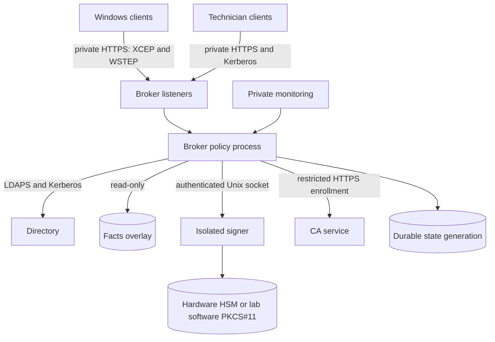
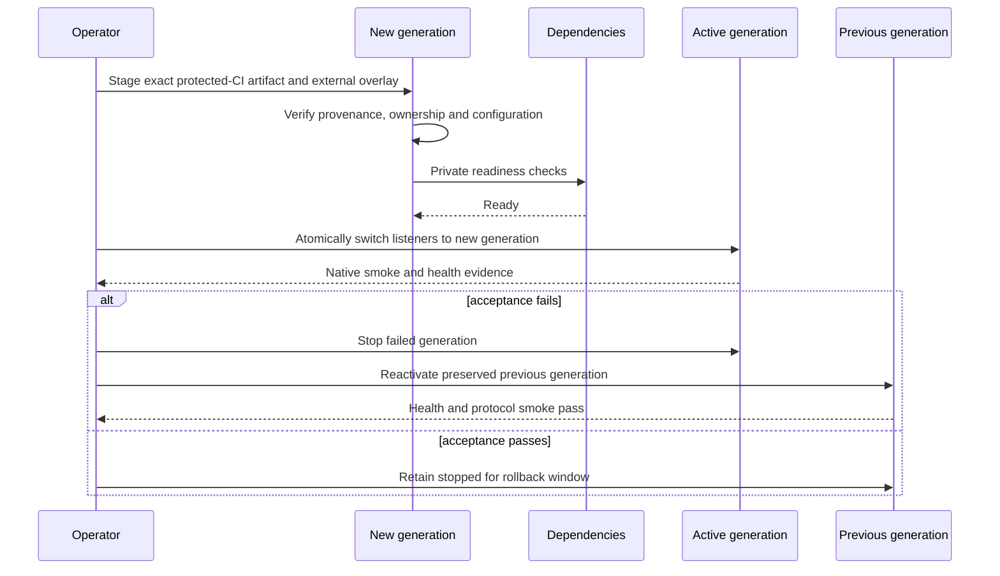

# Deployment topology and rollback

Keep all listeners private. Separate the signer process, identity, socket,
replay store and key provider from the network-facing broker. Mount configuration,
trust, facts, TLS, secrets and state from an external deployment root; do not
bake them into the image.

## Generation-based release

Rollback changes the active application generation and its compatible state as
one controlled action. Never delete the previous image, configuration, signer
generation, replay data or journals until the rollback window closes. A schema
change needs an explicit forward and reverse compatibility decision.

The included Compose file is a generic wiring example. It is not a production
orchestration design, firewall policy, backup system or secret provider.
