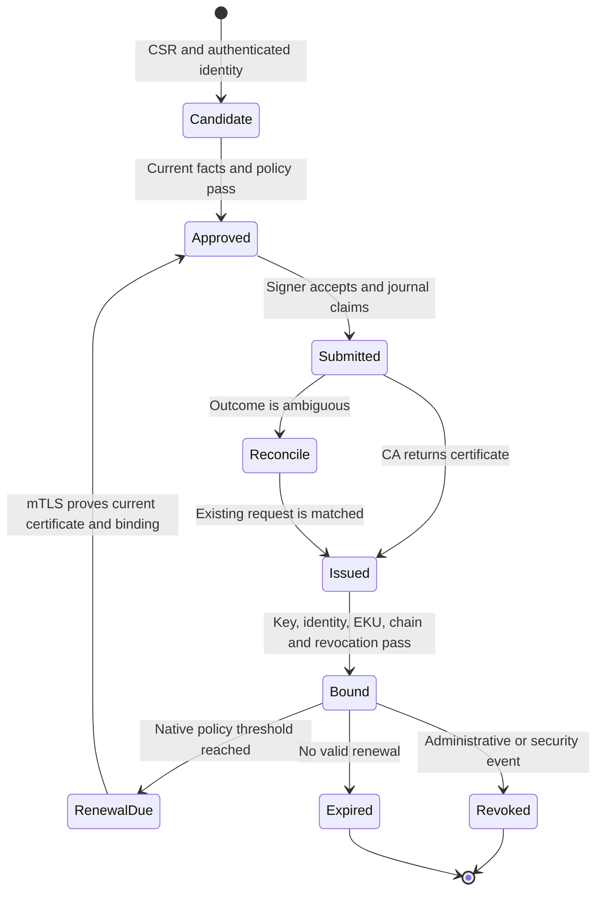

# Certificate lifecycle and renewal

Renewal is a fresh policy decision. The client proves possession of an existing
broker-issued certificate; the broker checks its durable asset binding and
re-reads current authoritative facts. A same-key or new-key request must still
satisfy the configured CMC profile and returned-certificate validation.

Windows native policy and EAP-TLS select certificates according to certificate
properties. Operators should retire superseded certificates so that multiple
simultaneously suitable certificates do not make selection ambiguous.

Revocation publishing, trust distribution and certificate cleanup are external
operational responsibilities. Monitor them alongside broker readiness.
