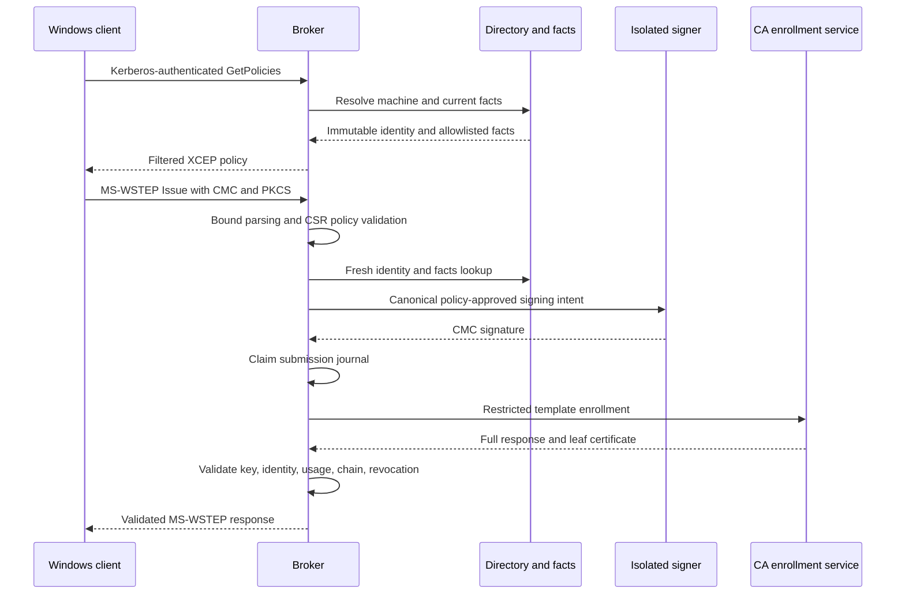
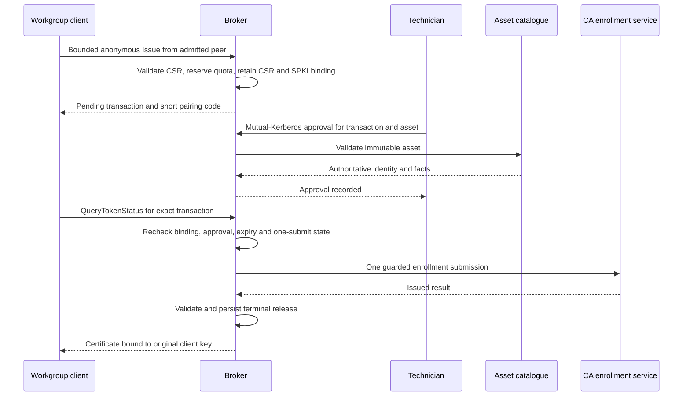
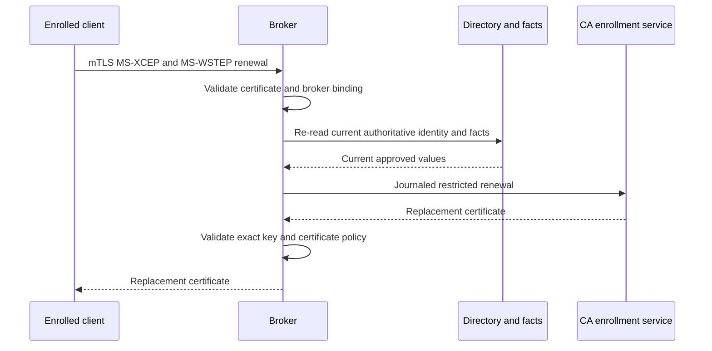

# Enrollment protocol flows

These sequences show the security-relevant transitions. Transport details use
the supported MS-XCEP and MS-WSTEP profiles described by the public source.

## Domain enrollment

## Guarded bootstrap

The pairing code locates a transaction; it never grants authority and is never
derived from the private key. Approval requires authenticated technician policy
and an existing immutable asset.

## Certificate renewal

Windows chooses a suitable client certificate during EAP-TLS and native
enrollment according to its policy and certificate properties. Deployments must
avoid leaving multiple simultaneously suitable certificates when deterministic
selection matters.

Continue with the [signer flow](signer-flow.md), [facts update flow](facts-flow.md)
and [certificate lifecycle](certificate-lifecycle.md).
