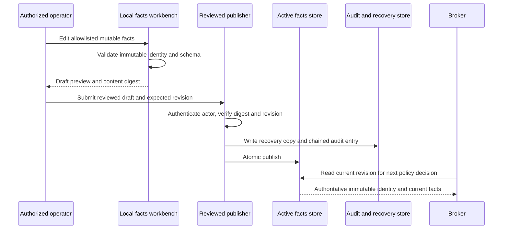

# Operational facts update flow

The workbench creates a draft; it cannot publish. The publisher runs under a
separate identity, accepts only allowlisted fields, protects immutable asset
identity, performs optimistic revision checks and records a hash-linked audit
entry. Facts affect the next enrollment or renewal decision; editing facts does
not rewrite an already-issued certificate.

If publication fails after a recovery record is written, operators reconcile
the recorded revision and hashes before retrying. Never repair the active JSON
file by hand.
