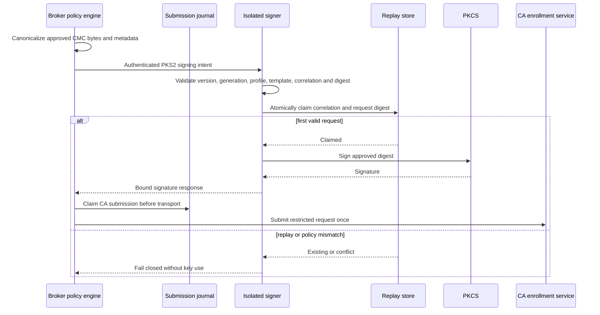

# Signer request and replay flow

The signer does not decide device identity. It independently limits how its key
can be used. Unknown configuration, legacy framing, unauthenticated peers,
generation mismatch and correlation reuse fail before signing. Replay state is
durable across signer restart and rotation.

The journal and signer replay store solve different problems: the signer stops
duplicate key use, while the journal prevents a retry from becoming a second CA
submission. Ambiguous CA outcomes require reconciliation, never a blind retry.
