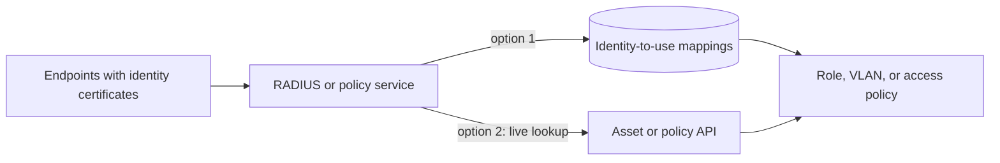
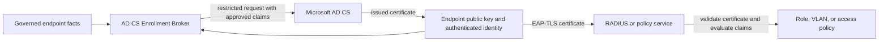
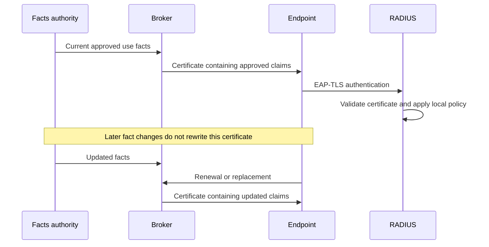

# Why this exists

## Authentication is not the whole authorization decision

EAP-TLS can prove that an endpoint holds the private key for a certificate
issued by a trusted authority. That establishes a strong identity, but network
and application policy often needs more context: what the endpoint is, what it
is used for, who governs it, or which access role it is eligible to receive.

A conventional device certificate may identify the machine without carrying
the stable operational facts needed by those rules. The RADIUS server or other
relying party must recover the missing context somewhere else before it can
choose a role, VLAN, or access policy.

## The usual choices without a broker

One approach is to maintain identity-to-role mappings in RADIUS. This can work,
but the policy service accumulates a large copy of asset data. Certificate
identities, device purpose, and access rules must stay synchronized, and each
new endpoint or changed use can require another mapping update.

Another approach is to call an inventory or policy API during authentication.
That centralizes the data, but it places every authentication decision behind
another live dependency. API latency, an outage, or an integration failure can
delay or prevent authentication across the estate.

Both approaches are valid in the right environment. The tradeoff is between a
large synchronized ruleset and a highly available online lookup path.

## Carry governed endpoint facts in the certificate

AD CS Enrollment Broker moves the fact-resolution step to enrollment and
renewal. It authenticates the requester, reads governed endpoint facts,
allowlists the claims permitted by the certificate profile, and asks AD CS to
issue a certificate containing that approved snapshot. In this implementation,
deployment policy controls the exact subject and SAN encoding.

  <figure class="asset-card">
    
    <figcaption>Source of truth supplies governed facts</figcaption>
  </figure>
  <figure class="asset-card">
    
    <figcaption>Endpoint retains its private key</figcaption>
  </figure>
  <figure class="asset-card">
    
    <figcaption>Broker governs claims; AD CS issues</figcaption>
  </figure>
  <figure class="asset-card">
    
    <figcaption>Access point carries the EAP-TLS exchange</figcaption>
  </figure>
  <figure class="asset-card">
    
    <figcaption>Access network enforces the RADIUS result</figcaption>
  </figure>

The relying party can now validate one certificate and apply a compact ruleset
to its approved claims. It does not need to call the broker or the facts service
during each EAP-TLS exchange. The same pattern can support other certificate-
based authentication systems when their policy engine can safely consume the
allowlisted claims.

The certificate does not assign a VLAN or grant access by itself. RADIUS or the
other relying party remains authoritative for the final decision, including
certificate chain, revocation, issuer, usage, and local policy checks.

## A signed snapshot, not a live database record

Certificate claims are a signed snapshot of governed facts at issuance time.
Changing a fact does not modify a certificate that is already installed. The
new value appears at the next authorized enrollment or renewal unless policy
revokes or otherwise rejects the older certificate first.

Certificate lifetime, renewal cadence, and revocation policy therefore define
how quickly a changed fact affects access. Facts placed in certificates should
be stable enough for that model; rapidly changing state belongs in a live policy
system instead.

Continue with [concepts](concepts.md), the
[system context](architecture/system-context.md), and the
[certificate lifecycle](protocols/certificate-lifecycle.md).
