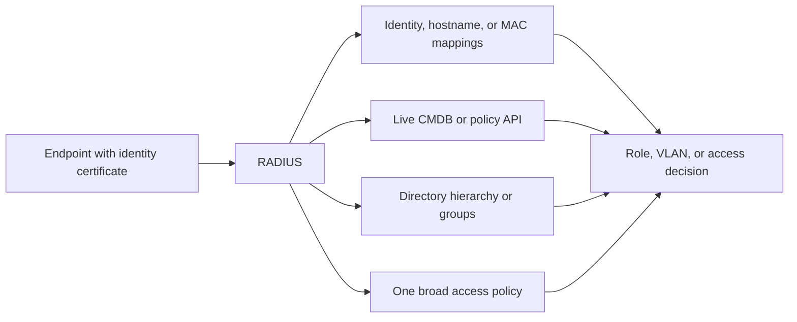
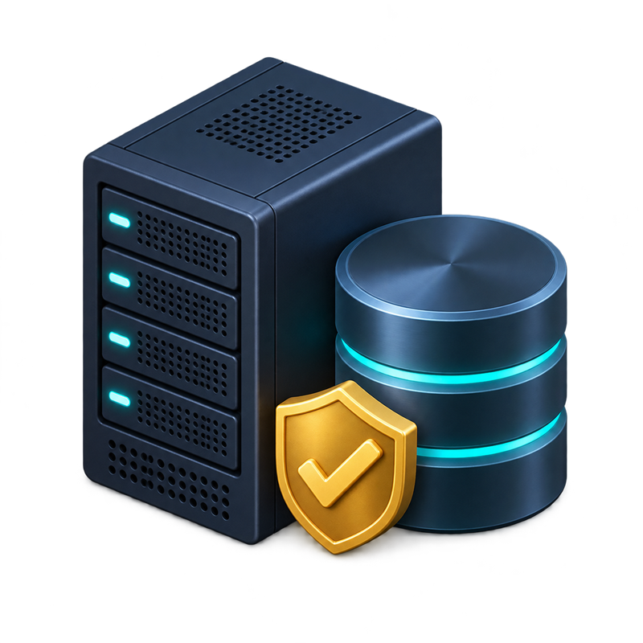
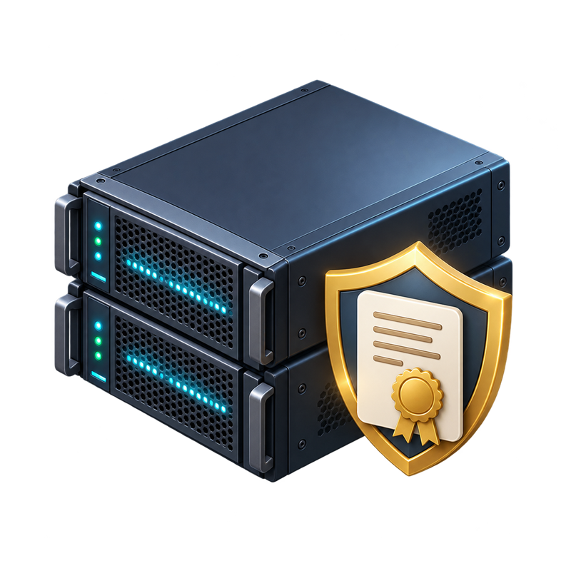
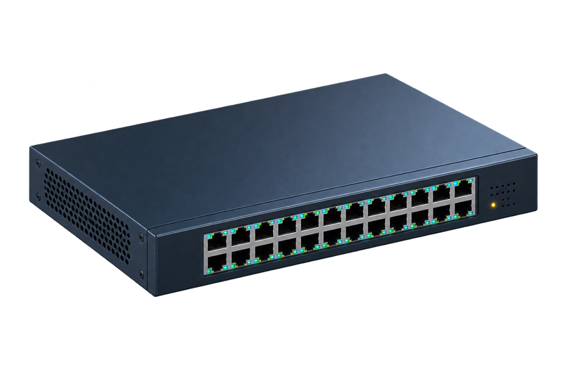
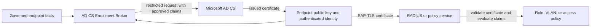
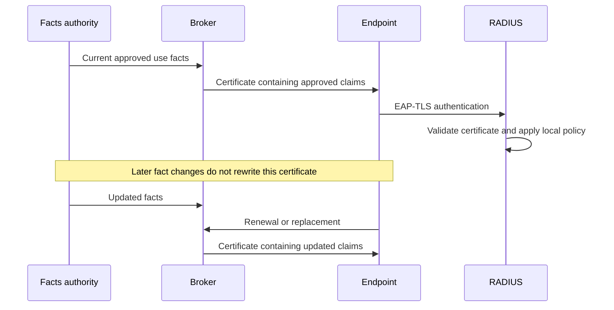

# Your 802.1X works. Now make it useful.

You did the sensible thing. You followed the vendor guide, survived the NPS
dialog boxes, deployed certificates, configured EAP-TLS, and watched a Windows
machine join the network without anybody typing a shared password.

The supplicant speaks.

The access point carries the message.

RADIUS checks the certificate.

The door opens.

Beautiful.

Then somebody asks a perfectly reasonable question:

> Can engineering devices go to the engineering VLAN, shared kiosks get only
> kiosk access, and everything else land somewhere appropriately boring?

This is where the tidy 802.1X diagram usually stops being helpful.

## A machine identity is not a job description

EAP-TLS is very good at proving that an endpoint holds the private key for a
certificate issued by an authority you trust. It can tell RADIUS, with strong
cryptographic evidence, *this is that enrolled machine*.

It does not automatically tell RADIUS what the machine is for.

Is it a developer workstation, a laboratory instrument, a kiosk, a warehouse
terminal, or the laptop connected to the projector that everyone is frightened
to reboot? Those are operational facts. They normally live in an asset system,
CMDB, device-management platform, or another governed source of truth. They are
often exactly the facts wanted by a VLAN, role, or application-access rule.

So now RADIUS has an identity and your organization has context. The only small
remaining problem is getting the two to meet without building a second career
out of it.

## The traditional menu of mild suffering

### Turn RADIUS into an asset database

You can maintain mappings from certificate identities, hostnames, or MAC
addresses to network roles. This works. It also means your policy service grows
a shadow inventory that must agree with the real inventory.

MAC address bypass is useful for devices that cannot perform 802.1X, but a MAC
address is observable and spoofable; it is not equivalent to certificate-backed
machine identity. Hostname mappings are stronger only to the extent that their
source and update process are trustworthy. Either way, every new device,
retirement, rename, and change of purpose becomes synchronization work.

The rules begin small.

Then the spreadsheet arrives.

Then the spreadsheet gains an owner.

Then the owner goes on holiday.

### Put a live API call in the authentication path

You can have RADIUS query the CMDB or a policy API during authentication. Now
there is one source of truth, which is pleasant, but network access depends on
that source answering correctly and quickly every time.

The API needs high availability. The integration needs timeouts, caching,
failure policy, monitoring, and a convincing answer to: “What happens to every
office login when this service has a bad morning?” These problems are solvable.
They are also now part of your authentication system.

### Make the directory tree explain the whole company

You can encode device purpose in organizational units or groups and derive
policy from directory placement. Groups are often useful. An OU can also be a
reasonable administrative boundary.

Trouble starts when a tree built for delegation and Group Policy is forced to
model every independent fact about an endpoint. A machine can have one position
in an OU hierarchy but many useful attributes. Rearranging that hierarchy to
express a new network role can alter GPO scope, delegation, software deployment,
and the assumptions of the next administrator who opens Active Directory Users
and Computers.

The directory tree becomes interpretive dance.

### Or declare that segmentation was overrated

One broad network is certainly easy to document.

It is less fun to explain during an incident.

These are not foolish designs. Small environments can run happily on mappings.
Well-engineered API integrations can be excellent. Directory groups can express
useful policy. The problem appears when the mechanism becomes a strained copy of
facts that already have a governed home, or when failure of a supplementary
lookup can interrupt authentication across the estate.

## Enter the broker, cape optional

AD CS Enrollment Broker changes *when* the systems meet.

Instead of asking RADIUS to discover device purpose during every EAP-TLS
exchange, the broker resolves stable, governed facts during certificate
enrollment and renewal. It authenticates the requester, binds it to the approved
asset, reads the authoritative facts, allowlists the claims permitted by the
certificate profile, and asks Microsoft AD CS to issue the result.

The endpoint still creates and retains its private key. The endpoint does not
get to invent its subject, SAN claims, template, or issuer. Deployment policy
controls the exact subject and SAN encoding. The broker validates the returned
certificate before releasing it.

  <figure class="asset-card">
    
    <figcaption>Source of truth supplies governed facts</figcaption>
  </figure>
  <figure class="asset-card">
    
    <figcaption>Endpoint retains its private key</figcaption>
  </figure>
  <figure class="asset-card">
    
    <figcaption>Broker governs claims; AD CS issues</figcaption>
  </figure>
  <figure class="asset-card">
    
    <figcaption>Access point carries the EAP-TLS exchange</figcaption>
  </figure>
  <figure class="asset-card">
    
    <figcaption>Access network enforces the RADIUS result</figcaption>
  </figure>

At connection time, RADIUS validates the certificate and evaluates a compact
local rule against the approved claim. It does not need to call the broker or
the facts service. The access point and switch continue doing ordinary 802.1X
work. The broker is not sitting in the packet path, waiting to become an exciting
new way to lose Wi-Fi.

The same pattern can support other certificate-based authentication systems
when their policy engine can safely consume the allowlisted claims.

## The certificate carries a signed snapshot, not live truth

This design deliberately trades a live lookup for a signed snapshot.

If the source of truth changes a device from `engineering` to `retired`, the
certificate already installed on that device does not magically edit itself.
The new claim appears at the next authorized enrollment or renewal unless policy
revokes or rejects the older certificate first.

Certificate lifetime, renewal cadence, revocation, and relying-party policy
therefore determine how quickly a changed fact affects access. Put stable facts
in the certificate: device class, governed use, or another attribute that can
reasonably live for the certificate lifetime. Keep rapidly changing signals in
a live policy system. A certificate is signed evidence, not a tiny distributed
database with delusions of grandeur.

## Who remains in charge

The broker does not assign a VLAN and the certificate does not grant access by
itself. RADIUS or the other relying party remains authoritative for the final
decision. It must still validate the chain, issuer, revocation state, EKU, usage,
approved claim syntax, and its own local policy.

The broker's job is narrower and more useful: turn authenticated endpoint
identity plus governed, stable facts into a certificate that an existing policy
engine can evaluate without maintaining a second asset inventory or making a
new live call during every authentication.

That is the whole trick.

No new protocol at the access point.

No private key leaving the endpoint.

No CMDB outage between a user and the network.

Just better facts, placed where the authorization system can use them.

Continue with [concepts](concepts.md), the
[system context](architecture/system-context.md), and the
[certificate lifecycle](protocols/certificate-lifecycle.md).
